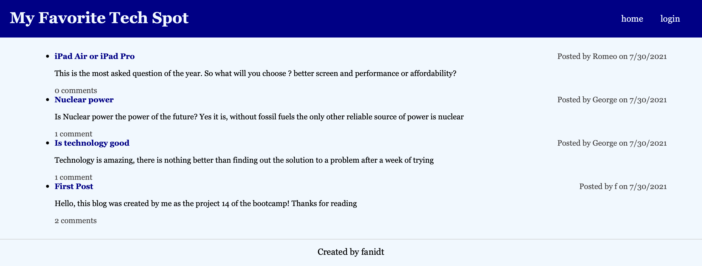

# My Favorite Tech Spot

 ## Link to deployed application/Repository:  
  https://myfavtechspot.herokuapp.com

 # Table of contents  
 -[Description](#Description)  
 -[User Story](#UserStory)  
 -[Badges](#Badges)  
 -[Screenshot](##Screenshot)  
 -[Installation](#Installation)  
 -[Support](#Support)  
 -[Contributions](#Contributions)  
 -[Authors](#Authors)  
 -[License](#Licence)  

  ## Description:  
  It is a blog about technology

  ##User Story:  
  AS A developer who writes about tech  
  I WANT a CMS-style blog site  
  SO THAT I can publish articles, blog posts, and my thoughts and opinions
  
  ## Badges:  
  
  
  ## Screenshot:  
   
  
  ## Installation:  
  No installation required to view the website
  
  ## Support:  
  Contact us by email at: fanidt@gmail.com  
  Contact us at Github at: https://github.com/fanidt

  ## Contributions:  
  No contributions

  ## Authors:  
  fanidt
  
  ## Licence:  
  MIT  
  License Link: https://opensource.org/licenses/MIT

